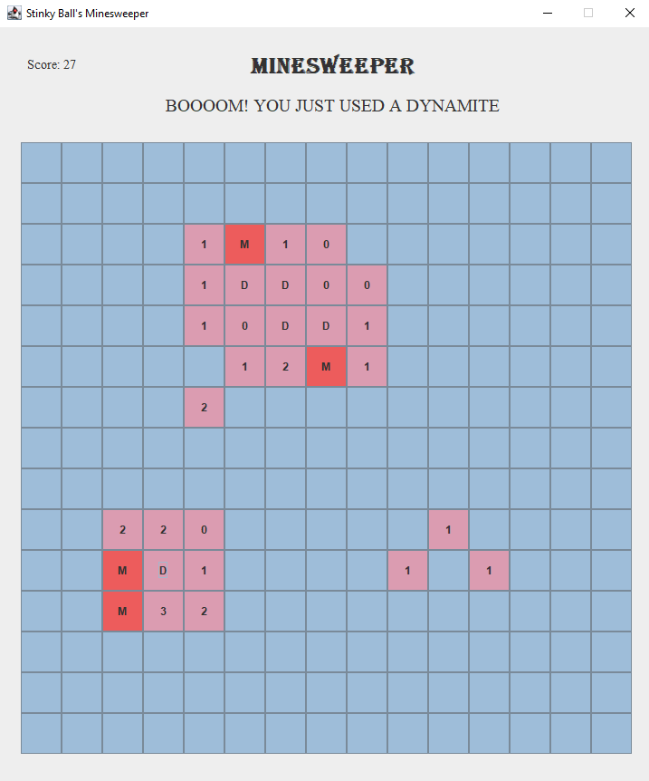
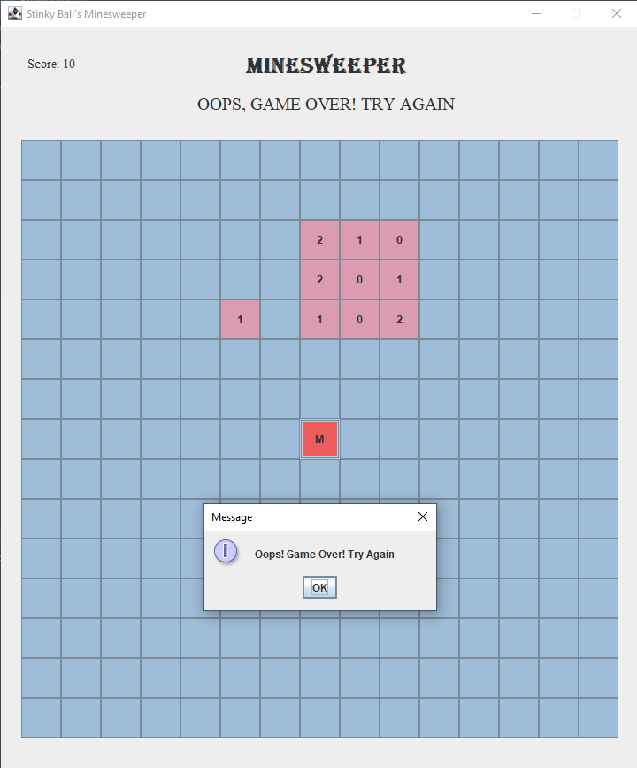

Minesweeper 
<i><b>M</b>: Mine (Game Over)</i>  
<i><b>D</b>: Dynamite (Uncover all eight neighbouring cells)</i>

Uncover all cells without detonating any mine! You can stumble upon dynamites which you can use to uncover a block of cells together.
